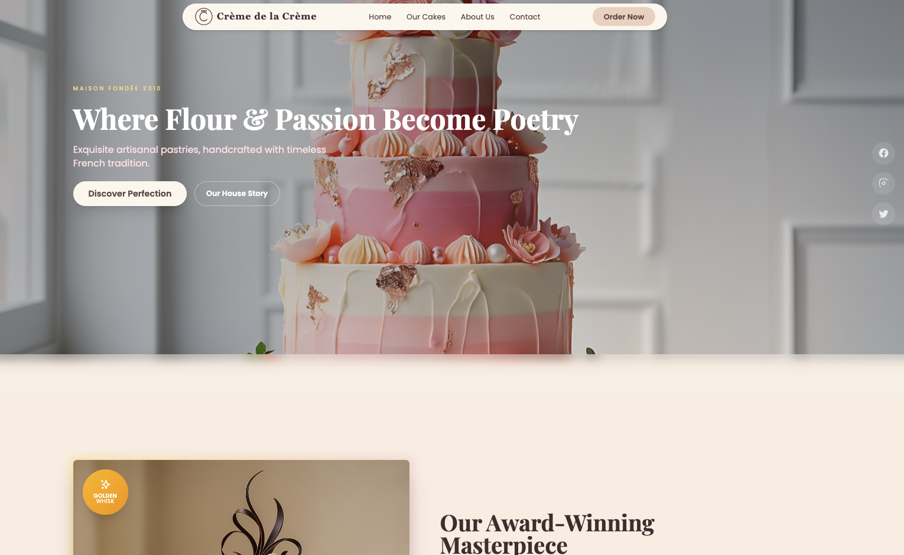

# Cakehouse



Brand-forward landing page for Crème de la Crème Patisserie, a fictional French artisanal bakery. The site combines editorial typography, layered imagery, and motion-driven storytelling to present the brand through a full-height hero with floating social icons, a featured award-winning cake showcase with glowing gradient effects, a scroll-animated brand history timeline, and a structured contact footer.

Built with Next.js 16, React 19, and Framer Motion. Animations include staggered scroll reveals, hover-triggered scale and lift effects, and backdrop blur transitions on the sticky navigation. The color palette draws from warm pastry tones with cream, beige, and brown accents throughout.

## Tech Stack

| Component | Technology | Version |
|-----------|-----------|---------|
| Framework | Next.js | 16.2 |
| UI | React | 19.2 |
| Language | TypeScript | 6.0 |
| Animation | Framer Motion | 12.38 |
| Styling | Tailwind CSS | CDN |

## Features

| Section | Description |
|---------|-------------|
| Navigation | Sticky header with responsive mobile menu |
| Hero | Layered background treatment with call to action |
| Showcase | Award-winning cake feature section |
| History | Animated brand timeline with scroll-triggered motion |
| Footer | Contact details and social links |

## Quick Start

```bash
git clone https://github.com/psandis/cakehouse.git
cd cakehouse
npm install
npm run dev
```

Open http://localhost:3133.

## Project Structure

```
cakehouse/
├── app/
│   ├── layout.tsx              Root HTML layout, fonts, Tailwind CDN
│   └── page.tsx                Main page composition
├── components/
│   ├── Header.tsx              Sticky navigation + mobile menu
│   ├── Hero.tsx                Hero section
│   ├── Showcase.tsx            Featured cake section
│   ├── History.tsx             Animated timeline
│   └── Footer.tsx              Contact and social footer
└── public/images/              Site imagery
```